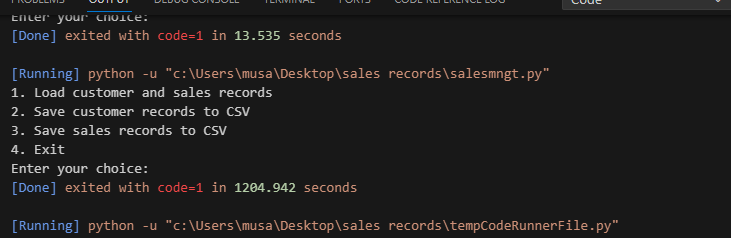

## Question 1 
## Function Definition: 
* The load_records function is defined with two parameters, customers_file_path and sales_file_path, which are expected to be the file paths to the customer and sales CSV files, respectively
  ```
  def main(customers_file_path=None, sales_file_path=None):
    if customers_file_path and sales_file_path:
        load_records(customers_file_path, sales_file_path
  ```

## Loading Customer Records
* The function starts by opening the customer records CSV file using the open function in read mode ('r').
* It then creates a csv.DictReader object, which reads the CSV file into a dictionary where each row is a dictionary with keys corresponding to the header names.
* The function iterates over each row (customer record) in the CSV file.
* For each row, it adds an entry to the records['customers'] dictionary with the customer * ID (cust_id) as the key and the entire row (which is a dictionary of customer details) as the value.
  ```
  def load_records(customers_file_path, sales_file_path):
    # Load customer records
    with open(customers_file_path, mode='r', newline='') as file:
        reader = csv.DictReader(file)
        for row in reader:
            records['customers'][row['cust_id']] = row
  ```
## Loading Sales Records:
* Similarly, the function opens the sales records CSV file in read mode.
* It creates another csv.DictReader object for the sales records.
* It then reads all the rows in the sales CSV file and stores them as dictionaries in the records['sales'] list.
  ```
  # Load sales records
    with open(sales_file_path, mode='r', newline='') as file:
        reader = csv.DictReader(file)
        records['sales'] = [row for row in reader]
  ```
  
## Data Structure in Memory:
* The records data structure is a dictionary with two keys: 'customers' and 'sales'.
* 'customers' is a dictionary itself, with customer IDs as keys and dictionaries of customer details as values.
* 'sales' is a list, where each element is a dictionary representing a sale record.

## Error Handling
* The with statement in Python automatically closes the file after the nested block of code is executed, ensuring that file resources are properly released.

## Output


* Question 2 & 3 I have just advance question 1  and the documentation is in the final code documentation
## Final code documentation
## Main Module Documentation
 The main module provides the core logic to run the customer/sales record management program.

## Overview
The key functions are:
* display_menu() - Shows menu options and gets user input
* main() - Main program logic
  

## Usage
* Run python main.py to start the program. Can optionally pass CSV file paths to load initial data.
```
python main.py customers.csv sales.csv
```
```
Functions
display_menu()
Shows a menu prompt and gets user selection.
```

## Logic:

* Print menu options
* Get and return user input choice
* Example Output:

1. Load records
2. Add customer
3. Quit

* Enter your choice: 


```
main()
Main program logic.

Parameters:

customers_file_path - Optional path to customer CSV file
sales_file_path - Optional path to sales CSV file
Logic:

Initialize CustomerModule and SalesModule
If file paths provided, load initial data
Loop:
Show menu and get choice
Perform action based on choice
Exit on 'Quit'

## Example Usage:

customer_mod = CustomerModule()
sales_mod = SalesModule()

main('customers.csv', 'sales.csv')
```
This loads the data, shows the menu, and processes actions until the user quits.

```
Imports
The main modules imports:

csv - for reading/writing CSV files
argparse - for parsing command line arguments
customer_module, sales_module - the modules containing the program logic
Command Line Arguments
Can specify customer/sales CSV files when running:

python main.py customers.csv sales.csv
```

## Customer Module Documentation
## Overview
* The CustomerModule class in customer_module.py provides functionality to manage customer and sales records in Python.

* It can load records from a CSV file, add new customers and sales through a CLI, save records back to CSV, and analyze monthly sales performance.

## Usage
* To use the module:

* Create an instance of CustomerModule

* Load customer/sales data from a CSV file using load_customers_and_sales()

* Add new customers with add_new_customer()

* Add new sales records with add_new_sales_record()

* Save updated data to CSV with save_customers_and_sales_to_csv()

* Analyze monthly sales with analyze_monthly_sales()
```
Methods
__init__()
Initializes the class instance:
```
* Sets up dtype for records array
* Initializes empty records array
* Sets starting counters for IDs
* Defines month name list
* load_customers_and_sales()
* Loads customer and sales data from a CSV file.

## Parameters:

file_path: Path to CSV file
Logic:

* Open file and create CSV reader
* Skip header row
* Append each row to records array
* save_customers_and_sales_to_csv()
* Saves customer and sales records to a CSV file.

## Parameters:

file_path: Path to write CSV file
Logic:

* Open file and create CSV writer
* Write header row
* Write each customer record (excluding sales details)
* add_new_customer()
* Adds a new customer by prompting user for details.
* 
## Logic:
* Prompt for name, postcode, phone number
* Generate new customer ID
* Append new record to array
* Print new customer ID
* add_new_sales_record()
* Adds new sales record for a customer.
```
Parameters:

cust_id: ID of customer
Logic:
```
* Prompt for sales date, category, value
* Generate new transaction ID
* Find matching cust_id in records
* Append new sales data to this record
* Print new transaction ID
* analyze_monthly_sales()
* Analyzes sales performance by month.
  
```
Logic:
```
* Filter records for sales
* Convert dates to datetimes
* Total and count sales for each month
* Return monthly totals
* Data Structures
* records: NumPy structured array to store customer and sales data
* months: List of month names for analyzing sales
* Key Attributes
* next_cust_id: Counter for generating customer IDs
* next_trans_id: Counter for generating transaction IDs

# Main Module Documentation

The main module provides the core logic to run the customer/sales record management program.  

## Overview

The key functions are:

* display_menu() - Shows menu options and gets user input  
* main() - Main program logic

## Usage

* Run python main.py to start the program. Can optionally pass CSV file paths to load initial data.


python main.py customers.csv sales.csv


## Functions

display_menu()
Shows a menu prompt and gets user selection.  


Logic:

Print menu options
Get and return user input choice
Example Output:
Load records
Add customer
Quit
Enter your choice:
```
main()
Main program logic.

Parameters:

customers_file_path - Optional path to customer CSV file
sales_file_path - Optional path to sales CSV file

Logic:

Initialize CustomerModule and SalesModule
If file paths provided, load initial data
Loop:
Show menu and get choice
Perform action based on choice
Exit on 'Quit'

** Example Usage:

customer_mod = CustomerModule()
sales_mod = SalesModule()

main('customers.csv', 'sales.csv') 


This loads the data, shows the menu, and processes actions until the user quits.

Imports
The main modules imports:

csv - for reading/writing CSV files
argparse - for parsing command line arguments
customer_module, sales_module - the modules containing the program logic

Command Line Arguments
Can specify customer/sales CSV files when running:

python main.py customers.csv sales.csv


Sales Module Documentation
Overview
The SalesModule class in sales_module.py provides functionality to manage sales records in Python.

It can load sales data from a CSV file, add new sales records, save records back to CSV, search records, and delete records.

The sales data is stored in a defaultdict with the customer ID as the key and a list of sales record dicts as the value.

Usage
To use the SalesModule:

Create an instance of SalesModule
Load sales data from CSV with load_sales()
Add new sales with add_new_sales_record()
Save sales data to CSV with save_sales_to_csv()
Search records with search_sales_records()
Delete records with delete_sales_record()
Methods
init()
Initializes a new SalesModule instance:

Sets up empty defaultdict for sales
Initializes transaction ID counter
load_sales()
Loads sales data from a CSV file into the sales defaultdict.

Parameters:

file_path: Path to CSV file

save_sales_to_csv()
Saves sales data from the sales defaultdict to a CSV file.

Parameters:

file_path: Path to write CSV file

add_new_sales_record()
Adds a new sales record to the sales defaultdict.

Parameters:

cust_id: Customer ID
date: Sale date
category: Sale category
value: Sale value

search_sales_records()
Searches for matching sales records.

Parameters:

search_query: Search query string

delete_sales_record()
Deletes a sales record matching the transaction ID.

Parameters:

trans_id: Transaction ID of record to delete

Data Structures
sales: defaultdict to store records, with customer ID as key

Key Attributes
next_trans_id: Counter for generating transaction IDs
```
